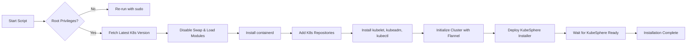

# Automated Kubernetes + KubeSphere Installer

This repository provides an `install.sh` script that automates the deployment of the latest stable **Kubernetes** and **KubeSphere** on an Ubuntu VPS.

---

## Features

* **Auto-Elevation to Root**: The script checks for root privileges and re-runs itself with `sudo` if needed.
* **Dynamic Versioning**: Automatically fetches the latest stable Kubernetes release unless a specific version is provided.
* **Configurable KubeSphere Version**: Default set to `v3.5.0`, but can be overridden via command-line.
* **Pre-Requisites Setup**: Disables swap, loads required kernel modules, and applies optimized `sysctl` settings.
* **Container Runtime**: Installs and configures `containerd`.
* **Kubernetes Tools**: Adds official repositories and installs `kubelet`, `kubeadm`, and `kubectl`.
* **Cluster Initialization**: Initializes the control-plane node with Flannel CNI.
* **KubeSphere Deployment**: Applies the official KubeSphere installer and waits for all components to be ready.

---

## Quick Start

```bash
curl -L \
  https://raw.githubusercontent.com/charlesvdd/kubesphere/install/install.sh \
  -o install.sh
chmod +x install.sh
./install.sh
```

---

## Architecture Flow



---

## README Sections

1. **Overview** – Summary of repository purpose.
2. **Features** – Highlight key capabilities.
3. **Quick Start** – How to execute the script.
4. **Architecture Flow** – Visual representation via Mermaid.
5. **License** – MIT.

---

## License

This project is licensed under the [MIT License](LICENSE).
